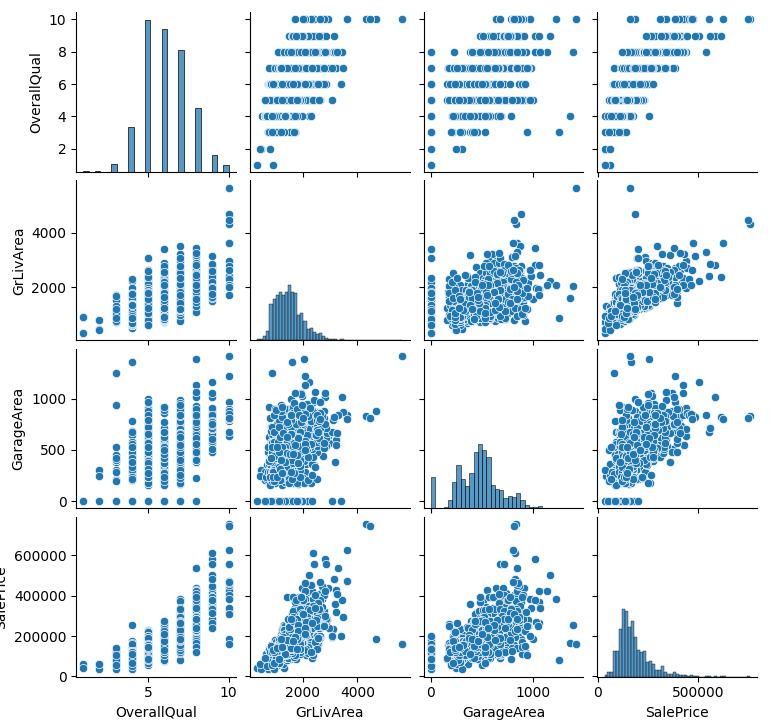

**1. Choose a dataset of your choice from the list given. Identify which
is the predicted**

**variable and which are the feature attributes.**

Chose Advanced Regression Techniques competition

https://www.kaggle.com/c/house-prices-advanced-regression-techniques/overview

It includes data_description.txt, sample_submission.csv, test.csv,
train.csv. Only train.csv contains full set of data therefore we can use
is as training and testing sets.

**2. Analyze the dataset in detail. This would involve finding
distribution of data and**

**correlation between variables. You might want to consider the pairplot
method available**

**in the Seaborn library:
<https://seaborn.pydata.org/generated/seaborn.pairplot.html>**

Corellation for sale price

Id -0.021917

MSSubClass -0.084284

LotFrontage 0.351799

LotArea 0.263843

**OverallQual 0.790982**

OverallCond -0.077856

YearBuilt 0.522897

YearRemodAdd 0.507101

MasVnrArea 0.477493

BsmtFinSF1 0.386420

BsmtFinSF2 -0.011378

BsmtUnfSF 0.214479

TotalBsmtSF 0.613581

1stFlrSF 0.605852

2ndFlrSF 0.319334

LowQualFinSF -0.025606

**[GrLivArea 0.708624]{.ul}**

BsmtFullBath 0.227122

BsmtHalfBath -0.016844

FullBath 0.560664

HalfBath 0.284108

BedroomAbvGr 0.168213

KitchenAbvGr -0.135907

TotRmsAbvGrd 0.533723

Fireplaces 0.466929

GarageYrBlt 0.486362

GarageCars 0.640409

**[GarageArea 0.623431]{.ul}**

WoodDeckSF 0.324413

OpenPorchSF 0.315856

EnclosedPorch -0.128578

3SsnPorch 0.044584

ScreenPorch 0.111447

PoolArea 0.092404

MiscVal -0.021190

MoSold 0.046432

YrSold -0.028923

SalePrice 1.000000

Name: SalePrice, dtype: float64

Figure 1. Pairplot of selected features.

**7. Compare the performance of the two models on the training and test
dataset. You**

**should use evaluation metrics such as R-Squared, Mean Squared Error,
and any other**

**metrics that you feel are relevant**.

LinearRegression

R-squared: 0.7306040498664287

MSE: 1102027991.178412

RMSE: 33196.80694251198

SGDRegressor

Pipeline(steps=\[(\'MinMax Scaling\', MinMaxScaler()),

(\'SGD Regression\',

SGDRegressor(max_iter=100000, n_iter_no_change=50,

penalty=None))\])

R-squared: 0.7305186194295772

MSE: 1105601663.0657866

RMSE: 33250.588913067186

**8. In the report, write a brief paragraph detailing which approach
gives you better results**

**and any other relevant findings.**

It was very difficult to make SGDRegressor converge. Hence, I decided to
use pipeline and scaling approach as both methods have similar
performance in terms of R score.

**[Python code can be on Google Colab]{.ul}**
<https://colab.research.google.com/drive/1QkAy_nKT1MZkCPqS1o0_toJ6KYs2qVku?usp=sharing>
