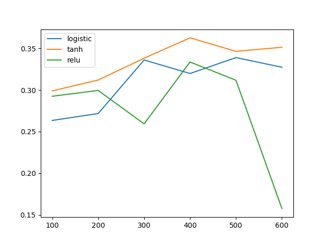

# Comparison of Sigmoid or Logistic Activation Function, Tanh and ReLU Activation Functions

## Output for your dataset summarized in a tabular format for different combination of parameters.

Activation =logistic

epochs train test train test

accuracy accuracy MSE MSE

100 0.2679878 0.2634731 903.5252828 866.71429

200 0.2733580 0.2717422 905.9877388 868.99572

300 0.3421253 0.3361848 1365.1516491 1383.95081

400 0.3188385 0.3199316 1632.1982701 1565.24964

500 0.3434559 0.3390362 1619.7339607 1572.48503

600 0.3344264 0.3274879 1684.3282007 1702.10351

Activation =tanh

epochs train test train test

accuracy accuracy MSE MSE

100 0.3003992 0.2989735 1609.4706777 1570.51084

200 0.3131356 0.3120901 1412.1608687 1332.46749

300 0.3512499 0.3383234 929.4499097 900.79569

400 0.3724931 0.3628457 640.6511738 573.41089

500 0.3469252 0.3465925 1486.8011121 1426.22327

600 0.3577607 0.3514400 919.1986028 926.28557

Activation =relu

epochs train test train test

accuracy accuracy MSE MSE

100 0.2974052 0.2925577 1619.6592054 1596.93242

200 0.2975002 0.2995438 1434.2904667 1362.03407

300 0.2586256 0.2593385 902.2068244 866.61007

400 0.3392263 0.3337610 1505.0343123 1484.13202

500 0.3210721 0.3118050 1602.8229731 1596.93727

600 0.1639103 0.1573995 883.2386655 850.39107

## Model history plots for every model. Model history is a plot of accuracy against the number of epochs.

## A brief report summarizing your results. For example, which activation function performed the best and why do you think so. Any assumptions that you made.

Selected num_hidden_layers = \[7, 5\] as the Activation function tanh performed the best as it's accuracy score 0.3628457 is highest and MSE = 573.41089 is lowest.

Tanh Activation function seem to be superior then the Sigmoid Activation function because the range of this activation function is higher than the sigmoid activation function.
Tanh activation function output is zero-centered. Therefore, in practice, the tanh non-linearity is always preferred to the sigmoid nonlinearity. It has a derivative of up to 1.0, making the updates of W and b much larger. This makes the tanh function almost always better as an activation function (for hidden layers) rather than the Sigmoid or Logistic Activation Function.